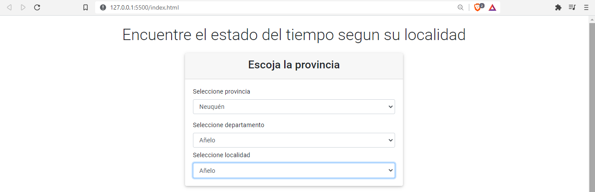
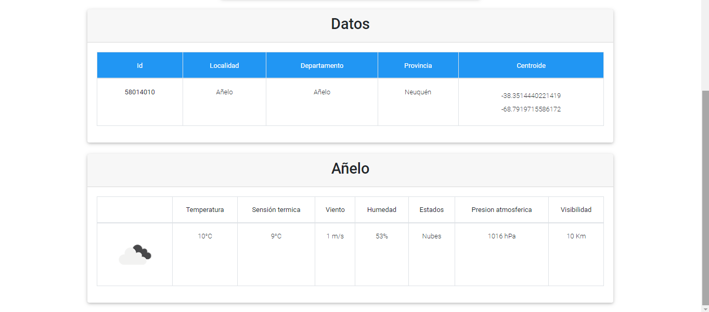

## Estado del clima segun la localidad elegida

Se trata de un combo select que a medida que vas escogiendo, la provincia, departamento y localidad obtienes los datos de la localidad y los estado del clima

> Recursos utilizados
* HTML
* [Bootstrap](https://mdbootstrap.com/)
* [Javascript](https://javascript.info/async-await)
* [Openweathermap](https://openweathermap.org/current)
* [Dataser-Argentina](https://datos.gob.ar/dataset/jgm_8/archivo/jgm_8.1)
